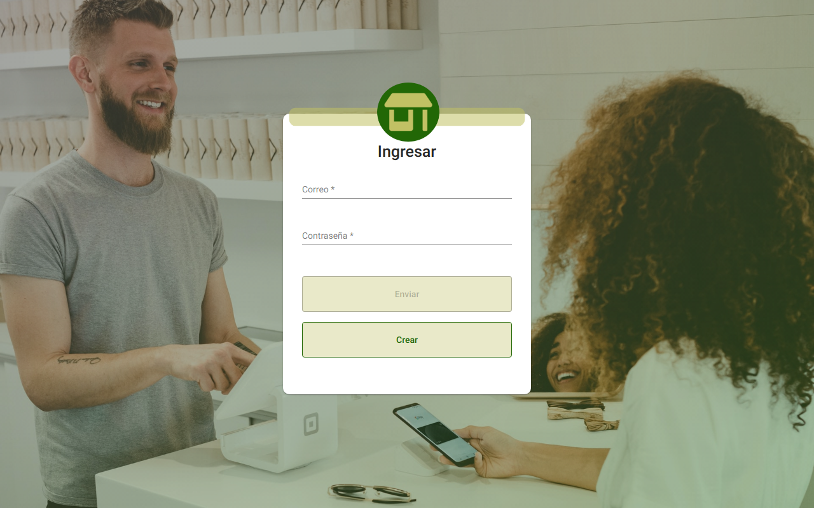
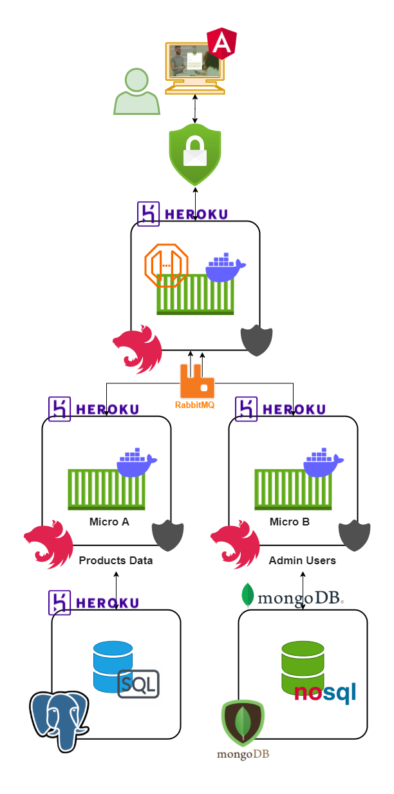

# DOKI-PET -> SIMPLE-COMMERCE-FRONT

This project was generated with [Angular CLI](https://github.com/angular/angular-cli) version 12.0.4.

## ARQUITECTURA DEL PROYECTO

<h1 align="center">
   
  <a href="https://simple-commerce-front.vercel.app/">SIMPLE-COMMERCE-FRONT</a>
</h1>

Prouecto desarrollado en angular 12 y Angular Material, el cual consiste en una pequeña aplicación para un sistema de facturas, este se encuentra alojado en Vercel (front) y en Heroku (back), a continuación se muestra la arquitectura del mismo. Este es contruido con el fin de convertirse en una tienda de mascotas pero con el tiempo se ha convertido en un proyecto generico para llevar al tanto la facturación de cualquier tienda, contando con componentes principales como: seguridad (tokens), dos microservicios (Autenticación) y (Negocio); Cuenta con las principales funcionalidades como:

 - Productos
    - Nombre
    - Precio
    - Cantidad
    - Estado
 - Clientes
    - Nombre
    - Apellido
    - Correo
    - Identificación  
    - Estado
 - Modos de Pago
    - Tipo
    - Estado
 - Facturas
    - Fecha
    - Total
    - Subtotal
    - Inpuestos
 - Detalles
    - Nombre Producto
    - Cantidad
    - Precio
    - Estado

<h1 align="center">
   
  <a href="https://simple-commerce-front.vercel.app/">SIMPLE-COMMERCE-FRONT</a>
</h1>
